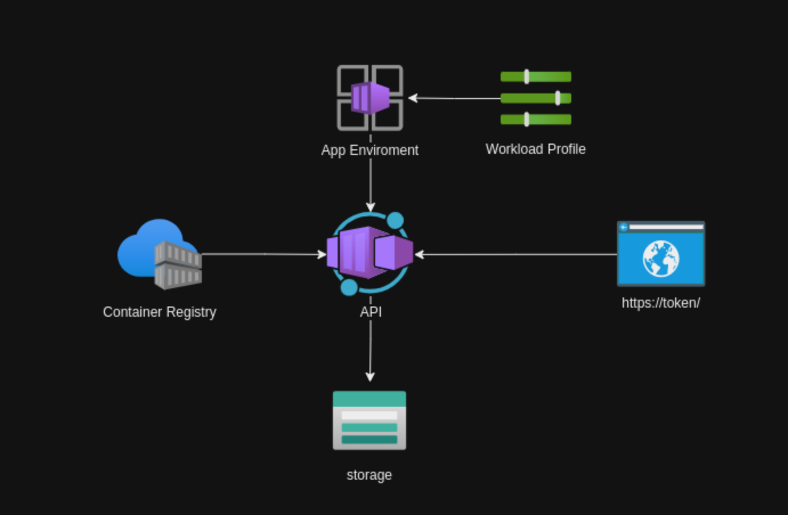

# TokenFlow


TokenFlow optimizes token generation and directory management across multiple tenants using Azure device flow. This repository empowers applications to capture user tokens seamlessly and utilize them for creating app registrations, users, and groups within accessible directories. Unlock the potential of multi-tenant applications with TokenFlow.



This is a straightforward setup for managing Azure resources using containerized applications and Blob Storage, coupled with an automated user login process via Azure Device Code.

Setup Overview
- **Azure Container App**: Acts as the host for TokenFlow Api Docker image.
- **Azure Blob Storage**: Manages state data related to Azure Command Line Interface (CLI) operations.

Login Flow
1. Prompt user authentication using Azure Device Code.
2. Upon successful login, retrieve access token for resource management from the provided endpoint.

## Hire me

Please send [email](mailto:kingdavidconsulting@gmail.com) if you consider to **hire me**.

[](https://www.buymeacoffee.com/vyve0og)

## Give a Star! :star

If you like or are using this project to learn or start your solution, please give it a star. Thanks!

## Running Locally

To run the application locally, follow these steps:

1. **Create a virtual environment:**

    ```bash
    python -m venv .venv
    ```

2. **Activate the virtual environment:**

    ```bash
    source .venv/bin/activate
    ```

3. **Install the dependencies management tool:**

    ```bash
    pip install pip-tools
    ```

4. **Compile the requirements:**

    ```bash
    pip-compile requirements.in
    pip-compile requirements.dev.in
    ```

5. **Install the dependencies:**

    ```bash
    pip install -r requirements.txt
    pip install -r requirements.dev.txt
    ```

6. **Run the application:**

    ```bash
    #only on WSL
    export X_AUTH_TOKEN=169ddeb1-502a-42cf-a222-9dbb8ec2cbf6
    uvicorn main:app --reload --port 6700
    ```

## Deploy the Container

To deploy the application using Docker, use the following steps:

1. **Pull the Docker container:**

    ```bash
    docker pull kdcllc/tokenflow
    ```

2. **Run the Docker container:**

    ```bash
    docker run -e LOGGING_LEVEL=INFO -e X_AUTH_TOKEN=<your_auth_token> -p 6700:6700 kdcllc/tokenflow
    ```

## Tests

```bash
     pytest tests/test_main.py
     pytest tests/test_authenticator.py
```

## API Documentation

Swagger documentation is available at [http://localhost:6700/docs](http://localhost:6700/docs).

## Environment Variables

- `LOGGING_LEVEL`: Sets the logging level (default is `INFO`).
- `X_AUTH_TOKEN`: Your authentication token for accessing the application.
